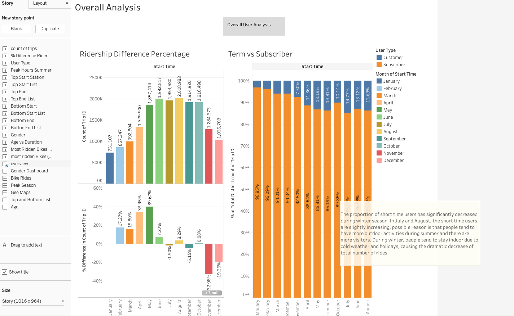
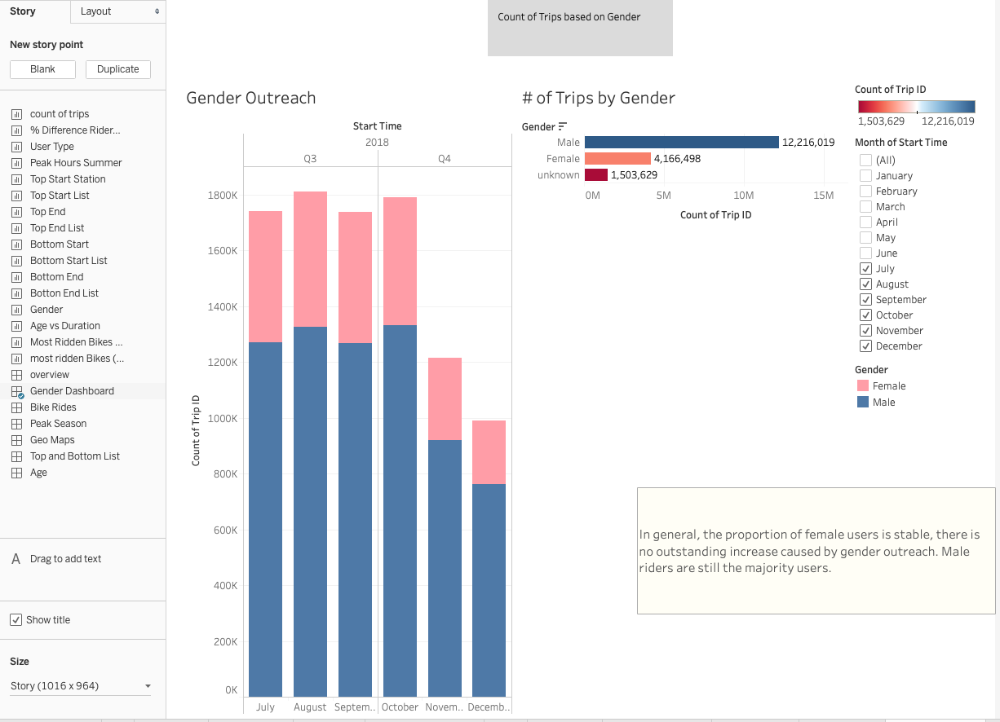
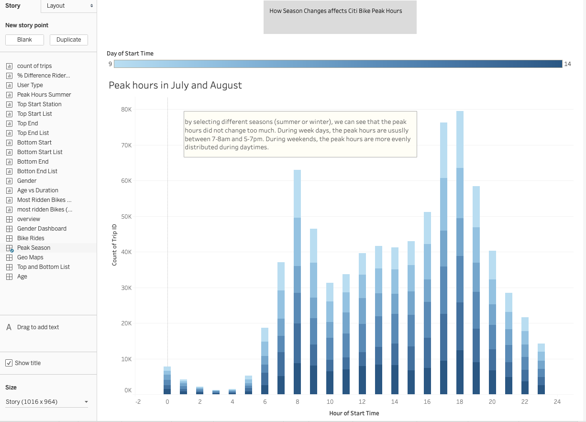
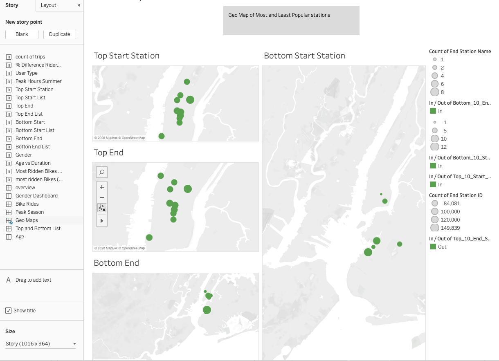
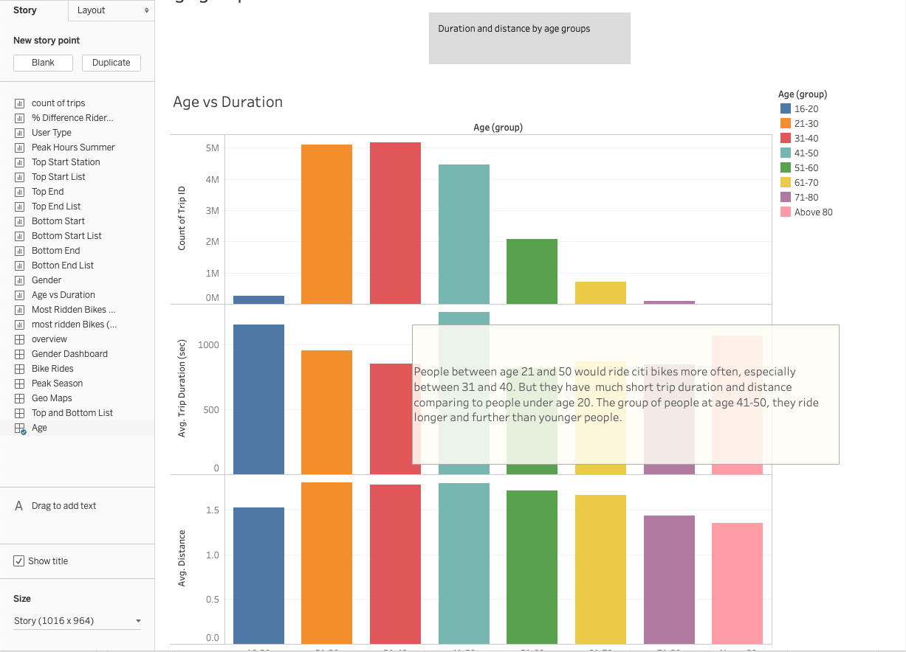

# Citi-Bike-Data-Visualization-Tableau

The task in this project is to aggregate the data found in the **Citi Bike Trip History Logs** to build a data dashboard that can answer the following questions:  

* How many trips have been recorded total during the chosen period?

* By what percentage has total ridership grown? 

* How has the proportion of short-term customers and annual subscribers changed?

* What are the peak hours in which bikes are used during summer months? 

* What are the peak hours in which bikes are used during winter months?

* What are the top 10 stations in the city for starting a journey? (Based on data, why do you hypothesize these are the top locations?)

* What are the top 10 stations in the city for ending a journey? (Based on data, why?)

* What are the bottom 10 stations in the city for starting a journey? (Based on data, why?)

* What are the bottom 10 stations in the city for ending a journey (Based on data, why?)

* What is the gender breakdown of active participants (Male v. Female)?

* How effective has gender outreach been in increasing female ridership over the timespan?

* How does the average trip duration change by age?

* What is the average distance in miles that a bike is ridden?

* Which bikes (by ID) are most likely due for repair or inspection in the timespan? 

* How variable is the utilization by bike ID?
 
## Data

The data used for this project were collected from [Citi Bike Data](https://www.citibikenyc.com/system-data), The data includes following information:

- Trip Duration (seconds)  
- Start Time and Date  
- Stop Time and Date  
- Start Station Name  
- End Station Name  
- Station ID  
- Station Lat/Long  
- Bike ID  
- User Type (Customer = 24-hour pass or 3-day pass user; Subscriber = Annual Member)  
- Gender (Zero=unknown; 1=male; 2=female)  
- Year of Birth  
- Age (as of 2017)
- Trip distance in miles

## Steps and Approach
 
 - first I wanted to extract data for 2018, 2019 and 2020 -> data_preparation.ipynb
 - created this pandas script to extract data for each year both JC and non JC
 - found issues with getting the data for 2019 non JC
 - after parsing the data for all three of the above years and combining to one csv, the data set got very large and was taking a long time to process so went with the data of a single year instead of combining several of them
 - decided to extract the entire data of only 2018 instead of 2019 since latter was giving errors for non JC data set using -> parsing_2018.ipynb
 - added two extra columns to the data set, distance of each trip iD and the age of the rider, all saved in the csv file :
 2018_parsed_citibikenyc_tripdata.csv
 - used teh above csv for the Tableau analysis

## Further plans

- will like to add analysis for 2020 and 2019 if time permits but for assignment submission I used the entire 2018 dataset

## online link to Tableau public

 - tried uploading the workbook to tableau online using -> server -> signin -> Tableau public -> save to Tableau public as 
 doesn't allow to upload using huge data set over certain number of rows so for now I will just submit my datasource and tableau analysis using github

## screen shots of the analysis 

    
